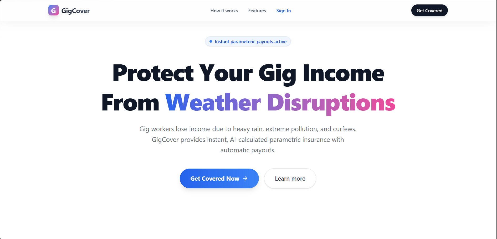
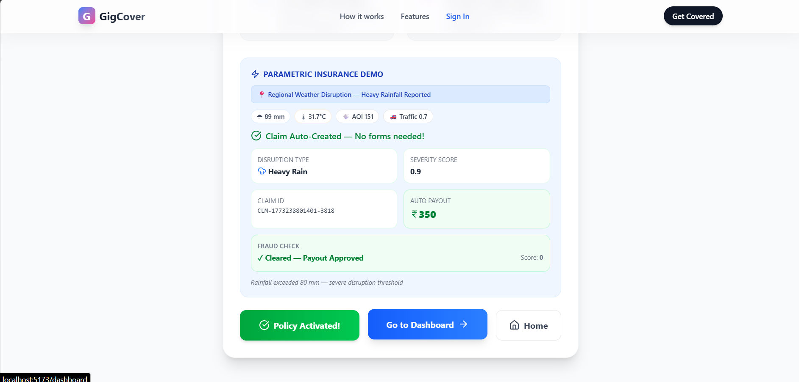
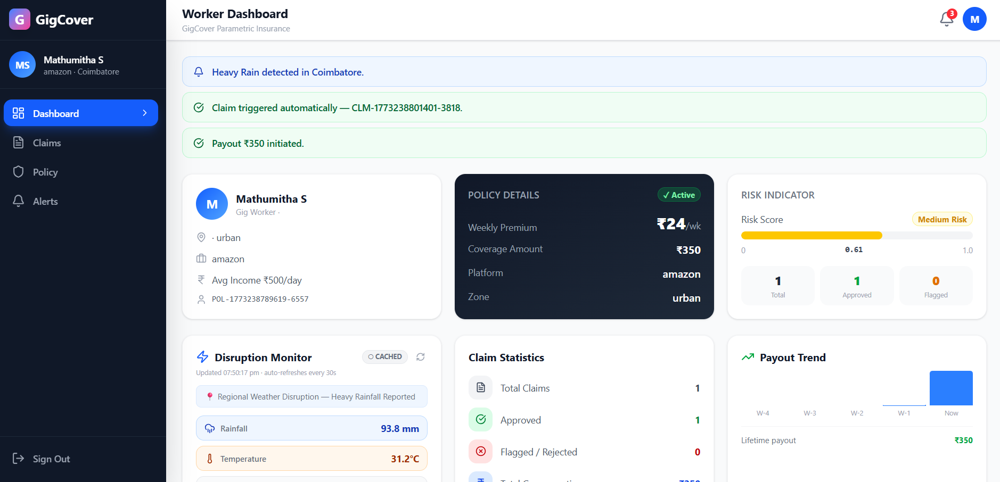
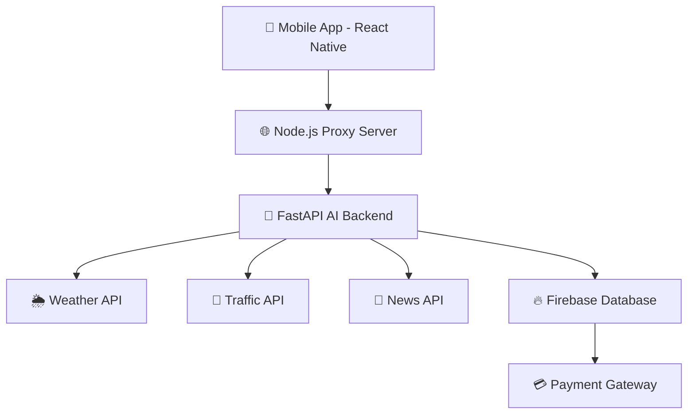
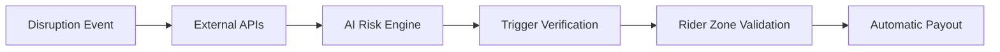

<p align="center">


</p>

<p align="center">

# 🚴‍♂️ GigSentry  
### AI-Powered Parametric Protection for Gig Delivery Workers

</p>

<p align="center">


</p>

---

# 🌍 Overview

**GigSentry** is an **AI-powered parametric income protection platform** designed for **gig delivery workers**, specifically **Swiggy and Zomato partners**.

Gig workers rely on **daily earnings**, but external disruptions often reduce their ability to work.

Common disruptions include:

• 🌧 Heavy Rain  
• 🔥 Heatwaves  
• 🚧 Strikes & Protests  
• 📵 Internet Shutdowns  
• 🚔 Traffic Restrictions  
• 🌫 Severe Pollution Alerts  

GigSentry automatically detects these events and **credits compensation instantly**.

> ⚡ **No claims. No paperwork. Automatic payouts.**

---

# 🎯 Problem Statement

Delivery partners depend on **consistent daily income**, but disruptions beyond their control reduce deliveries.

These events cause:

- Reduced working hours  
- Reduced delivery opportunities  
- Income instability  

Traditional insurance systems fail because they:

- Require manual claim filing  
- Have long processing times  
- Are not designed for gig-economy workers  

GigSentry solves this with **parametric protection powered by AI and real-time data**.

---

# 💡 Solution

GigSentry introduces **automatic parametric payouts** triggered by real-world events.

Workflow:

1️⃣ External event occurs (rain, strike, etc.)  
2️⃣ System verifies disruption using APIs  
3️⃣ Rider presence in affected zone is verified  
4️⃣ Compensation is automatically credited  

No claim filing required.

---

# 📱 App Preview

<p align="center">





</p>

Example screens:

• Rider dashboard  
• Disruption map  
• Payout notifications  
• Weekly premium summary

---

# 👤 User Personas

### 🚴 Ravi – Full-Time Rider

Platform: Swiggy  
Weekly earnings: ₹6000  

Problem: Heavy rain reduces deliveries.

GigSentry automatically detects rainfall and credits **₹400-₹500 compensation**.

---

### 🚴 Imran – Part-Time Rider

Platform: Zomato  
Income varies weekly.

GigSentry dynamically adjusts **premium and coverage based on earnings**.

---

### 🚴 Meena – EV Delivery Rider

Works in dense city zones.

Strikes and road closures reduce delivery opportunities.

GigSentry detects disruptions and **triggers automatic payout**.

---

# ⚙ Core Concept: Parametric Protection

GigSentry eliminates the traditional claim process.

Instead payouts are triggered when **predefined conditions occur**.

| Event | Trigger |
|------|--------|
| Heavy Rain | Rainfall above threshold |
| Heatwave | IMD heatwave alert |
| Strike / Protest | News disruption detection |
| Road Closure | Traffic API incidents |
| Internet Shutdown | Government restriction |
| Air Pollution | Severe AQI warning |

If the rider is in the **affected zone → payout triggered automatically**.

---

# 💰 Weekly Premium Model

Premiums are calculated based on rider earnings.

```
Premium = (Last Week Earnings × Base Rate) + Risk Coefficient
```

Base Rate  
**1.5% – 2% of weekly earnings**

Example:

Weekly earnings = ₹6000  

Premium ≈ **₹90 – ₹108**

---

# 💸 Dynamic Payout Model

Payout = **80% of average daily earnings**

Example:

Average daily earnings = ₹800  

Rain disruption payout ≈ **₹640**

Typical payouts range from:

**₹300 – ₹500 per disruption event**

---

# 🌐 Data Sources for Parametric Triggers

| Data | Source | Purpose |
|-----|------|------|
| Weather Data | Tomorrow.io API | Rain detection |
| Traffic Data | TomTom API | Road closures |
| News Data | NewsData.io | Strikes / protests |
| Rider Location | Mobile GPS | Zone verification |

---

# 🤖 AI / ML Integration

GigSentry uses AI across multiple modules.

---

## 🛡 Fraud Detection

Prevents false payout claims.

Techniques used:

• GPS verification  
• Wi-Fi signal validation  
• Cell tower triangulation  
• Sensor fusion  

Machine learning detects anomalies such as:

- impossible travel speeds  
- GPS spoofing  
- abnormal activity patterns

---

## 📊 Risk Modeling

AI calculates **dynamic risk coefficients** based on:

• historical disruptions  
• rider income volatility  
• environmental risk levels  

This ensures **fair premium pricing**.

---

## 🔎 Anomaly Detection

Algorithms used:

- Isolation Forest  
- Statistical anomaly detection  

These models detect suspicious payout claims.

---

# 🧠 System Architecture



---

# 🧭 System Workflow



---

# ⭐ Key Features

✔ Zero-claim parametric insurance  
✔ AI-powered risk modeling  
✔ Real-time disruption detection  
✔ Fraud detection system  
✔ Instant payouts  
✔ Weekly dynamic premium calculation  
✔ Live disruption monitoring  

Example notification:

> 🌧 Heavy rainfall detected in your zone  
> ₹450 credited to your account

---

# ➕ Additional Features

## 💬 AI Chatbot

In-app chatbot helps riders:

• understand coverage  
• check payout status  
• ask policy questions  

---

## 👥 Referral Program

Users can invite other gig workers.

Rewards may include:

- premium discounts  
- bonus coverage  
- reward credits  

---

# 🧰 Technology Stack

### 📱 Mobile Application
React Native (Expo)

### 🌐 Backend Gateway
Node.js proxy server

### 🤖 AI Backend
Python + FastAPI

### 🔥 Database
Firebase

### ☁ Cloud Infrastructure
Google Cloud Platform

Services used:

• Vertex AI  
• Gemini Models  
• Cloud Run  
• Cloud Functions  

---

# 📂 Project Structure

```
gigsentry
│
├── mobile-app
│   ├── screens
│   ├── components
│   └── navigation
│
├── backend
│   └── Node.js proxy server
│
├── ai-engine
│   └── FastAPI ML models
│
├── docs
│   ├── screenshots
│   ├── diagrams
│   └── demo gifs
│
└── README.md
```

---

# 📈 Development Roadmap

- [x] Research and problem validation  
- [x] Architecture design  
- [ ] MVP mobile application  
- [ ] AI risk modeling  
- [ ] Fraud detection system  
- [ ] Live disruption monitoring  
- [ ] Deployment on Google Cloud  

---

# 🚀 Future Improvements

• Integration with Swiggy / Zomato APIs  
• City-level disruption prediction  
• Rider safety alerts  
• Preventive weather notifications  
• EV delivery protection plans  

---

# 🌍 Impact

GigSentry aims to improve **financial stability for gig workers**.

Benefits include:

• instant compensation  
• no paperwork  
• fair dynamic pricing  
• protection against unpredictable disruptions  

---

# ⚙ Installation

Clone repository

```
git clone https://github.com/your-username/gigsentry
cd gigsentry
```

Install dependencies

```
npm install
```

Start development server

```
npm start
```

---

# 🤝 Contributing

1. Fork the repository  
2. Create a feature branch  
3. Commit your changes  
4. Submit a pull request  

---

# 📜 License

This project is developed for **research and hackathon purposes**.

---

