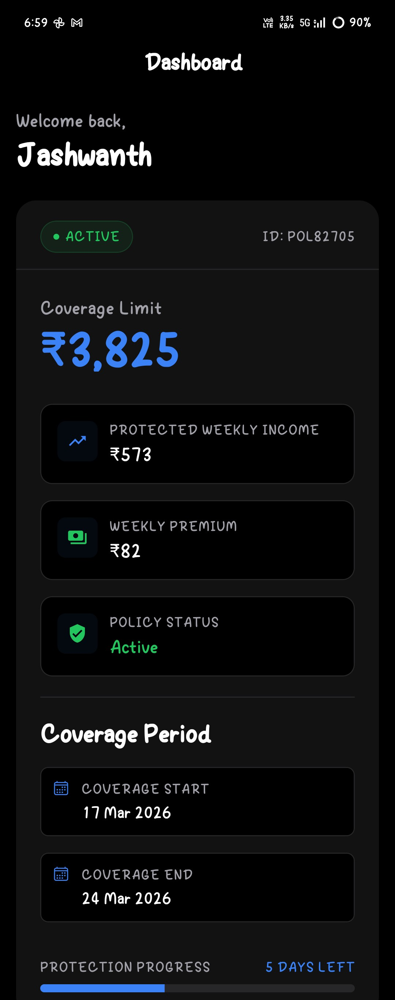
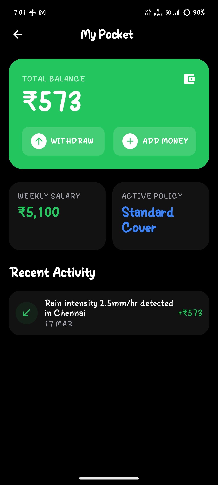
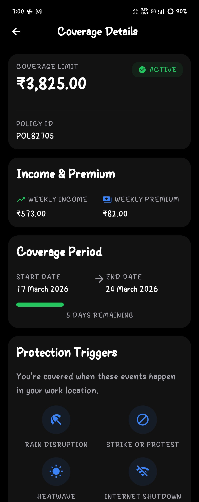
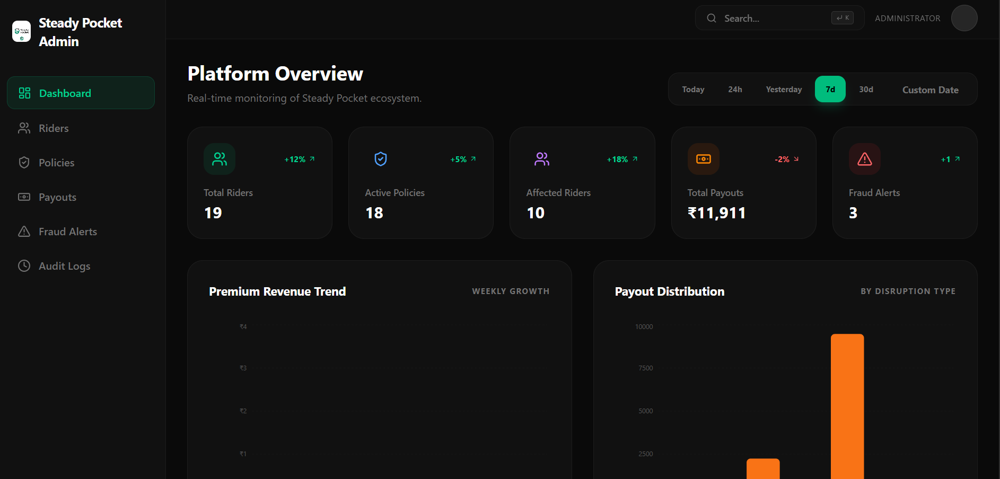
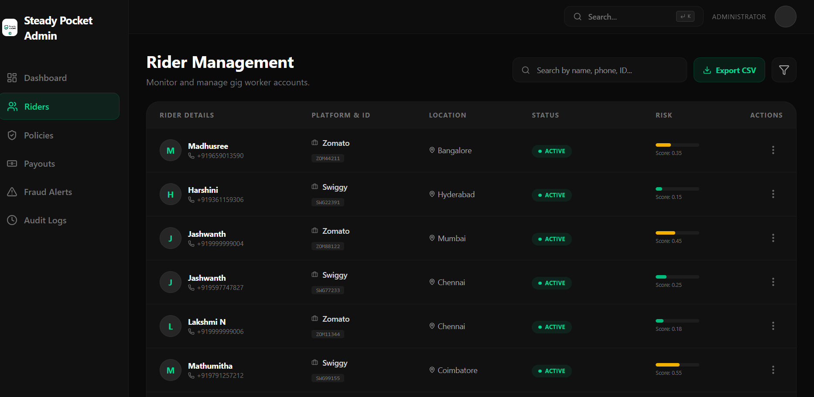
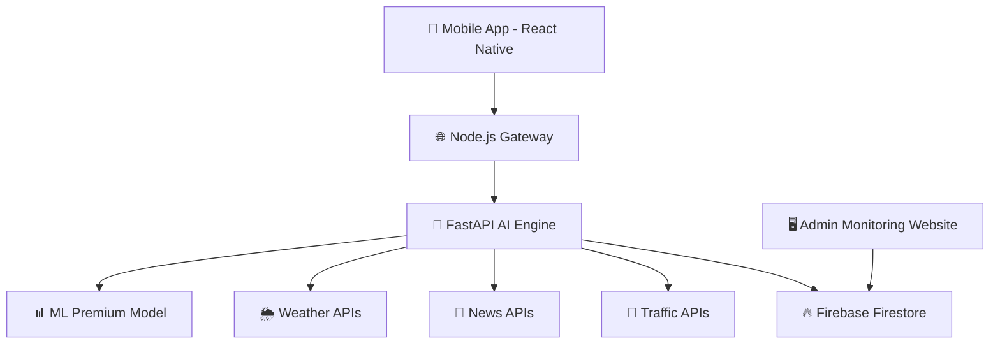
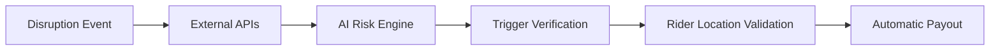

<p align="center">

</p>

<p align="center">

# 🚴‍♂️ Steady Pocket  
### Rain or strike payouts in your pocket

</p>

<p align="center">


</p>

---

# 🌍 Overview

**Steady Pocket** is an **AI-powered parametric income protection platform** designed for **gig delivery workers**, specifically **Swiggy and Zomato partners**.

Gig workers depend on **consistent daily earnings**, but disruptions often reduce their ability to work.

Common disruptions include:

• 🌧 Heavy Rain  
• 🔥 Heatwaves  
• 🚧 Strikes & Protests  
• 📵 Internet Shutdowns  
• 🚔 Traffic Restrictions  
• 🌫 Severe Pollution Alerts  

Steady Pocket automatically detects these events and **credits compensation instantly**.

> ⚡ **No claims. No paperwork. Automatic payouts.**

---

# 🎯 Problem Statement

Delivery partners rely on **daily earnings**, but external disruptions reduce delivery opportunities.

These disruptions cause:

- Reduced working hours
- Reduced delivery availability
- Income instability

Traditional insurance systems fail because they:

- Require manual claim filing
- Have long processing times
- Are not designed for gig workers

Steady Pocket solves this using **AI-powered parametric protection**.

---

# 💡 Solution

Steady Pocket introduces **automatic parametric payouts** triggered by real-world disruptions.

Workflow:

1️⃣ External event occurs (rain, strike, etc.)  
2️⃣ System verifies disruption using external APIs  
3️⃣ Rider presence in affected zone is verified  
4️⃣ Compensation is automatically credited  

No claim filing required.

---

# 📱 Rider App
<p align="center">
  
  
  
</p>

<p align="center">
  <b>Seamless rider experience • Real-time payouts • Smart risk alerts</b>
</p>

The Steady Pocket mobile app allows delivery partners to:

• verify identity  
• activate protection plans  
• view payouts  
• monitor disruptions  
• track coverage

---

# 📱 App Flow

### 1️⃣ Rider Verification

Users verify their identity through a secure onboarding flow.

Steps include:

- Phone number verification
- Swiggy / Zomato partner ID upload
- Face verification
- Government ID verification

This ensures only **legitimate delivery partners** can access protection.

---

### 2️⃣ Dynamic Policy Generation

Once verified, the system automatically generates a **weekly protection policy**.

Policy values depend on:

- weekly earnings
- work type (full-time / part-time)
- location risk
- environmental conditions

Policies are stored in **Firestore** and refreshed weekly.

---

### 3️⃣ Dashboard

The rider dashboard shows:

- Protected weekly income
- Weekly premium
- Coverage limit
- Active policy status
- Risk alerts

Example:

```
Protected Weekly Income: ₹6200  
Weekly Premium: ₹99  
Coverage Limit: ₹4650
```

---

### 4️⃣ Coverage Details

Riders can view full protection details including:

- coverage period
- disruption triggers
- premium calculation
- payout eligibility

---

### 5️⃣ Payout History

Users can see all automatic payouts triggered by disruptions.

Example:

```
Rain Disruption – Chennai
₹420 credited
```

---

### 6️⃣ Risk Alerts

The system alerts riders about upcoming disruptions.

Example:

```
🌧 Heavy rain detected in your zone
Potential payout may be triggered
```

---

# ⚙ Core Concept: Parametric Protection

Steady Pocket eliminates traditional claim processes.

Payouts are triggered when **predefined conditions occur**.

| Event | Trigger |
|------|--------|
| Heavy Rain | Rainfall above threshold |
| Heatwave | IMD heatwave alert |
| Strike | News disruption detection |
| Road Closure | Traffic API incidents |
| Internet Shutdown | Government restrictions |
| Air Pollution | Severe AQI levels |

If the rider is in the **affected zone → payout triggered automatically**.

---

# 💰 Weekly Premium Model

Premiums are calculated dynamically.

```
Premium = (Weekly Earnings × Base Rate) + Risk Coefficient
```

Base Rate:

**1.5% – 2% of weekly income**

Example:

Weekly income = ₹6000  

Premium ≈ **₹90 – ₹108**

---

# 💸 Dynamic Payout Model

Payout = **80% of average daily earnings**

Example:

Daily earnings = ₹800  

Rain disruption payout ≈ **₹640**

Typical payouts range between:

**₹300 – ₹500 per event**

---

# 🌐 Data Sources for Parametric Triggers

| Data | Source | Purpose |
|-----|------|------|
| Weather Data | Tomorrow.io API | Rain detection |
| Traffic Data | TomTom API | Road disruptions |
| News Data | NewsData.io | Strike detection |
| Rider Location | Mobile GPS | Zone verification |

---

# 🤖 Machine Learning Engine

Steady Pocket uses an ML model to generate **dynamic insurance policies**.

### Model Purpose

Predict:

- weekly premium
- coverage limit
- rider risk score

---

### ML Inputs

The model receives structured features such as:

- weekly earnings
- delivery activity
- working hours
- income volatility
- city risk score
- environmental risk factors

Example input:

```json
{
 "weekly_income_last_week": 6200,
 "deliveries_last_week": 112,
 "working_hours_last_week": 48,
 "zone_risk_score": 0.55
}
```

---

### ML Output

```json
{
 "recommended_premium": 102,
 "coverage_limit": 4800,
 "risk_score": 0.61
}
```

---


### Model Type


**XGBoost Gradient Boosting Regressor**

Reasons:

- High accuracy for tabular data
- Fast training
- Robust predictions

---

---

# 🛡 Adversarial Defense & Anti-Spoofing Strategy

To defend against coordinated GPS spoofing attacks, Steady Pocket implements a **multi-layer "Truth-of-Source" verification system** that validates not just location, but the *authenticity of how that location is generated*.

---

## 1️⃣ Differentiation: Genuine Worker vs Spoofed Actor

Steady Pocket does not trust GPS as a single source of truth. Instead, it performs **multi-signal validation combined with behavioral analysis**.

### 🔍 Truth-of-Source Analysis

The system compares **location data against real-world environmental and physical signals**.

#### Genuine Worker (Real Scenario)

- Shows **noisy and inconsistent signals**
- Weak Wi-Fi / cellular signals due to weather
- Continuous **micro-movements** (device vibrations, motion)
- Realistic travel history before disruption
- Environmental instability (pressure, network fluctuation)

#### Spoofed Actor (Fraud Scenario)

- Shows **clean and static signals**
- Stable home Wi-Fi or broadband IP
- No device motion (phone resting idle)
- Perfect GPS coordinates without natural drift
- No correlation with environmental conditions

---

### ⚙ Behavioral "Dead Reckoning" (Physics Check)

We use **device sensors to validate physical presence**:

- 📱 Accelerometer (motion detection)
- 🚶 Step Counter / Pedometer
- 📡 Device activity signals

#### Logic:

If:
- GPS shows user in a high-risk zone  
AND  
- Device shows **zero motion for extended duration (e.g., 60 minutes)**  

→ User is likely spoofing location.

This ensures **physics-based validation**, not just coordinate validation.

---

### 🚫 Mock Location Detection

We leverage native OS signals:

- Android/iOS mock location flags
- Developer mode detection

If enabled:

→ User is marked as **high-risk immediately**

(This is a lightweight but highly effective first-line defense.)

---

## 2️⃣ Data Intelligence Beyond GPS

Steady Pocket collects and analyzes **multi-dimensional data signals**.

---

### 📡 Network & Location Signals

- Cell tower triangulation
- Wi-Fi BSSID fingerprinting
- IP address consistency
- Google Geolocation API (Wi-Fi + cell-based location)

---

### 📱 Device Integrity Signals

- Device ID consistency
- Emulator / rooted device detection
- App tampering signals
- Device boot time vs location timestamp validation

#### Example Check:

If:
- Location timestamp ≠ device boot timeline  

→ Possible spoofing behavior

---

### 🌦 Environmental Correlation Signals

- Weather API vs user location consistency
- Signal attenuation during storms
- Barometric pressure (optional enhancement)

---

### 📊 Behavioral & Pattern Signals

- Sudden clustering of users in same zone
- Identical movement patterns across accounts
- Repeated payouts without delivery activity
- Unrealistic movement speeds

---

### 🔗 Firebase-Based Real-Time Intelligence

We use Firebase ecosystem for real-time validation:

- Firestore / Realtime DB → live location & sensor sync  
- Firebase Presence → user activity tracking  
- GeoFire → geo-based clustering detection  

This enables **real-time fraud detection across multiple users simultaneously**.

---

## 3️⃣ Coordinated Fraud (Syndicate) Detection

To prevent large-scale attacks:

- Detect clusters of users sharing:
  - same IP / Wi-Fi BSSID  
  - identical movement patterns  
- Identify synchronized payout triggers  
- Monitor abnormal payout spikes in specific zones  

### Response:

- Temporarily **pause payouts for suspicious clusters**
- Flag accounts for admin review
- Highlight anomalies in admin dashboard

---

## 4️⃣ Immediate "Kill Switch" Strategy

To prevent rapid exploitation:

### 🔐 Cloud Function Guard Layer

Every payout request passes through a **verification Cloud Function**:

- Cross-check device signals  
- Validate event consistency  
- Run fraud scoring model  

---

### 📸 Proof of Presence (On Demand)

If flagged:

User must submit:

- live photo / short video  
- metadata (EXIF) verified  

Using:

- Firebase Storage  
- Cloud Vision API  

This verifies whether the environment matches a real disruption scenario.

---

## 5️⃣ UX Balance: Conditional Escrow Workflow

To ensure fairness for genuine users, Steady Pocket uses a **tiered verification system**.

| Status      | Trigger Condition | Action |
|------------|-----------------|--------|
| ✅ Verified | Strong multi-signal match | Instant payout |
| ⚠ Flagged  | Signal mismatch (GPS vs network/sensors) | Held for review |
| ❌ Rejected | Strong fraud indicators (shared IP, spoofing patterns) | Block + investigation |

---

### 🧠 Fair Play Mechanism (Offline Resilience)

During poor connectivity (e.g., storms):

- App switches to **Offline Logging Mode**
- Captures encrypted sensor snapshots:
  - Cell ID  
  - Accelerometer  
  - network signals  

Once connection restores:

- Data syncs to Firebase  
- AI reconstructs a **"sensor timeline"**

If consistent with real disruption:

→ payout is approved **retroactively**

---

## 6️⃣ Decision Engine

```mermaid
graph TD

A[User Signals]
B[Multi-Signal Verification]
C[Fraud Detection Model]
D[Risk Score Engine]
E[Decision Layer]

A --> B
B --> C
C --> D
D --> E

E -->|Low Risk| Instant Payout
E -->|Medium Risk| Conditional Escrow
E -->|High Risk| Block + Review
```

---

## 🎯 Outcome

This architecture ensures:

✔ Strong protection against GPS spoofing  
✔ Detection of coordinated fraud syndicates  
✔ Real-time multi-signal validation  
✔ Fair handling of genuine users  
✔ Production-grade resilience under adversarial conditions  

Steady Pocket evolves into a **trust-first, intelligence-driven parametric protection system** capable of operating securely in real-world environments.

---

---

# 🖥 Admin Monitoring Platform
<p align="center">
  
  
</p>

<p align="center">
  <b>Centralized monitoring of users, payouts, and fraud detection</b>
</p>

Steady Pocket includes a **separate admin website** used by platform operators.

This system monitors:

- users
- policies
- payouts
- fraud alerts
- system activity

The admin platform connects directly to the same **Firestore database** used by the mobile app.

---

# 🧭 Admin Dashboard Features

### Platform Overview

Displays:

- total users
- active policies
- total payouts
- fraud alerts

---

### Rider Management

Admins can view rider profiles including:

- verification status
- policy details
- payout history
- fraud risk score

Admins can take actions such as:

- suspend account
- ban user
- mark for review

---

### Policy Monitoring

Admins can inspect all generated policies including:

- premium values
- coverage limits
- risk scores

This helps monitor the ML model behavior.

---

### Payout Monitoring

Track disruption events and payouts.

Example:

```
Rain Event – Chennai
Affected Riders: 320
Total Payout: ₹2,10,000
```

---

### Fraud Monitoring

The system automatically generates alerts for suspicious activities such as:

- GPS mismatch
- duplicate accounts
- unusual payout patterns

Admins can investigate and take action.

---

# 🧠 System Architecture



---

# 🧭 System Workflow



---

# ⭐ Key Features

✔ Parametric insurance model  
✔ AI-powered dynamic premiums  
✔ Automatic disruption detection  
✔ Real-time payouts  
✔ Fraud detection system  
✔ Admin monitoring platform  
✔ Risk alerts for riders  

---

# ➕ Additional Features

## 💬 AI Chatbot

In-app chatbot helps riders:

- understand policies
- check payout status
- ask coverage questions

---

## 👥 Referral Program

Users can invite other delivery partners.

Rewards may include:

- premium discounts
- bonus coverage
- referral credits

---

# 🧰 Technology Stack

### 📱 Mobile App
React Native (Expo)

### 🌐 Backend
Node.js Gateway

### 🤖 AI Backend
Python + FastAPI

### 🧠 Machine Learning
XGBoost

### 🔥 Database
Firebase Firestore

### 🖥 Admin Platform
Next.js + Node.js

### ☁ Cloud Infrastructure
Google Cloud Platform

Services used:

- Vertex AI
- Cloud Run
- Cloud Functions
- Firebase Hosting

---

# 📂 Project Structure

```
steady-pocket
│
├── mobile-app
│   ├── screens
│   ├── components
│   └── navigation
│
├── backend
│   └── Node.js gateway
│
├── ai-engine
│   └── FastAPI ML services
│
├── admin-dashboard
│   └── Next.js monitoring platform
│
├── docs
│   ├── screenshots
│   ├── diagrams
│   └── demo gifs
│
└── README.md
```

---

# 📈 Development Roadmap

- [x] Research and concept validation  
- [x] Architecture design  
- [x] Rider onboarding system  
- [x] Policy engine  
- [x] Dashboard and coverage UI  
- [ ] ML premium engine  
- [ ] Fraud detection automation  
- [ ] Admin monitoring platform  
- [ ] Deployment on Google Cloud  

---

# 🌍 Impact

Steady Pocket aims to improve **financial stability for gig workers**.

Benefits include:

• instant compensation  
• no paperwork  
• fair dynamic pricing  
• protection from unpredictable disruptions  

---

# ⚙ Installation

Clone repository

```
git clone https://github.com/your-username/steady-pocket
cd steady-pocket
```

Install dependencies

```
npm install
```

Start development server

```
npm start
```

---

# 🤝 Contributing

1. Fork the repository  
2. Create a feature branch  
3. Commit changes  
4. Submit a pull request  

---

# 📜 License

This project is developed for **research and hackathon purposes**.
