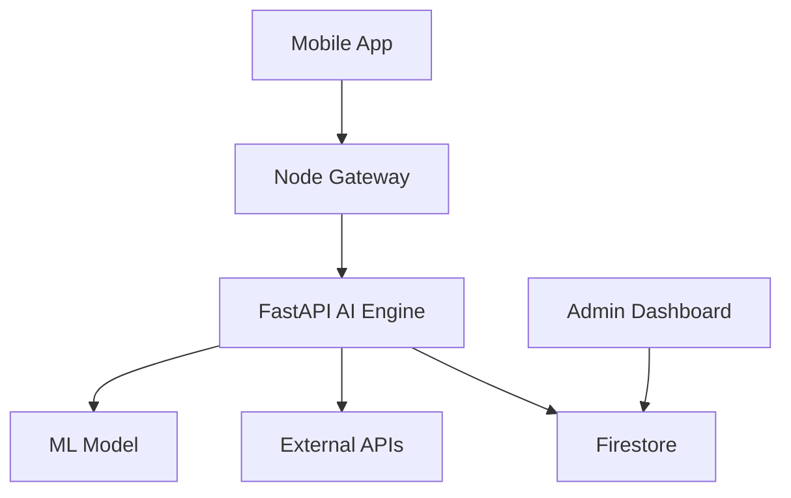

<p align="center">

</p>

<p align="center">

# 🚴‍♂️ Steady Pocket  
### Rain or strike payouts in your pocket

</p>

<p align="center">


</p>

---

# 🌍 Overview

**Steady Pocket** is an **AI-powered parametric income protection platform** for **gig delivery workers (Swiggy & Zomato partners)**.

Gig workers depend on daily earnings, but real-world disruptions reduce their ability to work.

Steady Pocket automatically detects these disruptions and **provides instant payouts without claims**.

> ⚡ No claims. No paperwork. Automatic payouts.

---

# 🎯 Problem Statement

Delivery partners face **income instability** due to:

- weather disruptions  
- strikes and road blocks  
- unpredictable working conditions  

Traditional insurance fails because it:

- requires manual claims  
- has delayed payouts  
- is not designed for gig economy dynamics  

---

# 👤 Target Users (Persona Understanding)

### 🚴 Full-Time Rider
- Works daily for primary income  
- Highly sensitive to disruptions  

### 🚴 Part-Time Rider
- Income fluctuates weekly  
- Needs flexible premium pricing  

### 🚴 High-Risk Urban Rider
- Works in dense, disruption-prone zones  
- Faces frequent income interruptions  

---

# 💡 Solution

Steady Pocket provides **parametric protection**:

1️⃣ Detect disruption via real-world data  
2️⃣ Verify rider presence  
3️⃣ Trigger payout instantly  

No claim filing required.

---

# 📱 Rider App

<p align="center">
  
  
  
</p>

<p align="center">
<b>Seamless experience • Real-time payouts • Smart risk alerts</b>
</p>
A mobile-first platform is chosen as delivery partners operate entirely through smartphones, enabling real-time tracking, sensor-based verification, and instant payout notifications.
---

# 📱 App Workflow

### 1️⃣ Verification
- Phone authentication  
- Partner ID verification  
- Live selfie + Govt ID  

---

### 2️⃣ Dynamic Policy Generation
Policies are generated weekly based on:
- income  
- work type  
- location risk  

---

### 3️⃣ Premium Activation
Users activate protection via weekly premium  
(simulated UPI payment for MVP)

---

### 4️⃣ Dashboard
Displays:
- protected income  
- premium  
- coverage  
- policy status  

Updated dynamically using ML.

---

### 5️⃣ Coverage Details
Shows:
- policy duration  
- eligible disruption triggers  

---

### 6️⃣ Wallet (My Pocket)
- in-app wallet for payouts  
- instant credit on disruptions  

---

### 7️⃣ Payout Engine
- triggered via Cloud Scheduler  
- validated via AI system  
- credited automatically  

---

### 8️⃣ Payout History
- full transparency of transactions  

---

### 9️⃣ Profile
- KYC status  
- risk score  
- user details  

---

# ⚙ Core Concept: Parametric Protection

| Event | Trigger |
|------|--------|
| Rain | Rainfall threshold |
| Heatwave | IMD alerts |
| Strike | News detection |
| Traffic | API signals |

If user is in affected zone → payout triggered automatically.

---

# 💰 Premium Model

```
Premium = (Weekly Earnings × Base Rate) + Risk Factor
```

Base Rate: **1.5% – 2%**

---

# 💸 Payout Model

```
Payout ≈ 70–80% of daily income
```

---

# 🔄 AI Integration in System Workflow

Steady Pocket integrates AI directly into the core decision pipeline rather than using it as a standalone module.

### End-to-End Flow

1️⃣ User completes verification  
2️⃣ System fetches weekly earnings + activity data  
3️⃣ Feature Engine aggregates:
- income patterns  
- location risk  
- environmental signals  

4️⃣ ML Model processes inputs and outputs:
- premium  
- coverage limit  
- risk score  

5️⃣ Policy is generated and stored in Firestore  

---

### During Disruption

1️⃣ External APIs detect disruption (rain / strike)  
2️⃣ System validates user presence using multi-signal verification  
3️⃣ Fraud Detection Model evaluates risk  

Decision:

- Low risk → payout triggered instantly  
- Medium risk → conditional escrow  
- High risk → blocked + flagged  

---

### Continuous Learning Loop

The system improves over time by:

- learning from past fraud cases  
- updating risk thresholds  
- adapting to new attack patterns  

This ensures the platform becomes **more accurate and resilient with usage**.

# 🛡 Adversarial Defense & Anti-Spoofing Strategy

Steady Pocket defends against GPS spoofing using **multi-signal “Truth-of-Source” validation**.

---

## 1️⃣ Differentiation

### Genuine User
- noisy signals  
- real motion  
- unstable network during storms  

### Fraud User
- static device  
- stable home network  
- perfect GPS spoof  

---

## Physics Check (Dead Reckoning)

If:
- GPS = storm zone  
- device = no motion  

→ flagged as spoofing  

---

## 2️⃣ Data Signals Used

- GPS + cell tower triangulation  
- Wi-Fi fingerprint (BSSID)  
- IP patterns  
- device integrity  
- behavioral patterns  

---

## 3️⃣ Syndicate Detection

- detect clusters with same IP / behavior  
- identify coordinated fraud  
- block suspicious groups  

---

## 4️⃣ Kill Switch

Cloud Function validates every payout:

- cross-check signals  
- run fraud scoring  
- block suspicious payouts  

---

## 5️⃣ UX Balance (Conditional Escrow)

| Status | Action |
|------|------|
| Verified | instant payout |
| Flagged | review |
| Rejected | blocked |

---

## Fair Play System

Offline sensor logging ensures genuine users are not penalized during network drops.

---

# 🖥 Admin Monitoring Platform

<p align="center">
  
  
</p>

<p align="center">
<b>Real-time monitoring • Fraud detection • System control</b>
</p>

---

## Features

- user monitoring  
- policy tracking  
- payout analytics  
- fraud detection  

---

# 🧠 System Architecture



---

# ⭐ Key Features

✔ AI-powered dynamic premiums  
✔ Automatic payouts  
✔ Fraud-resistant system  
✔ Real-time monitoring  
✔ Admin dashboard  

---

# 🧰 Tech Stack

Mobile: React Native  
Backend: Node.js  
AI: FastAPI  
DB: Firebase  
Cloud: GCP  

---

# 🌍 Impact

- financial stability for gig workers  
- instant compensation  
- zero-claim experience  

---

# 🛠 Development Plan

Steady Pocket is built using a modular, production-oriented architecture:

### Phase 1 (MVP)
- Rider onboarding and verification  
- Policy generation engine  
- Payment simulation  
- Wallet system  
- Basic payout engine  

---

### Phase 2 (AI Integration)
- ML model for premium prediction  
- Fraud detection system  
- risk scoring engine  

---

### Phase 3 (Scaling & Automation)
- real-time disruption detection  
- automated payout engine  
- admin monitoring dashboard  
- cloud scheduler integration  

---

### Deployment Strategy
- Backend services on Google Cloud Run  
- AI models via Vertex AI  
- Firebase for real-time data and authentication  

This phased approach ensures rapid MVP delivery while enabling scalable production deployment.

# 📜 License

Hackathon project