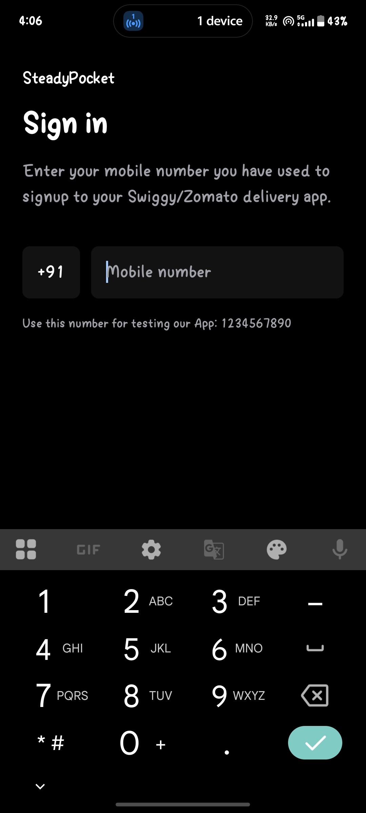
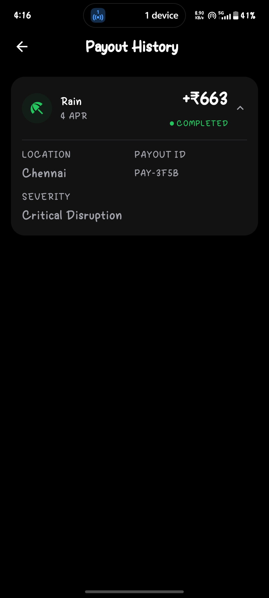
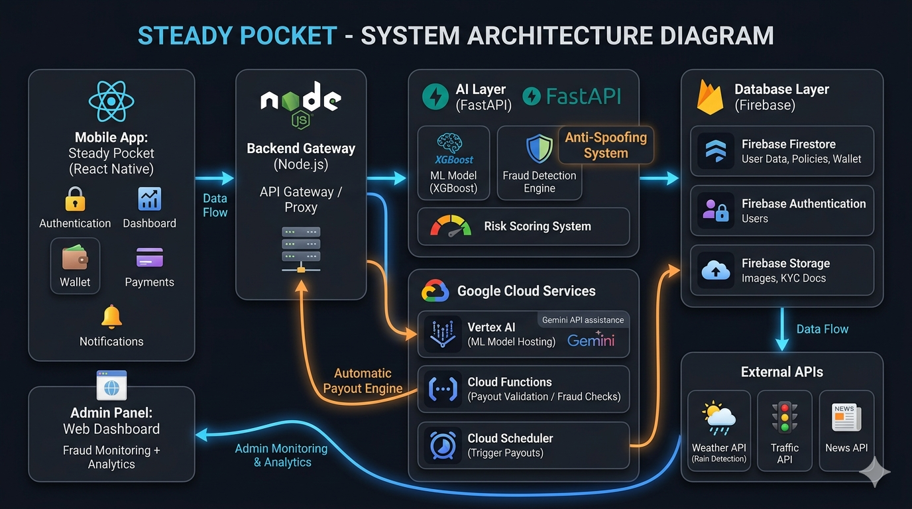

<p align="center">

</p>

<p align="center">

# 🚴‍♂️ Steady Pocket  
### Rain or strike payouts in your pocket

</p>

<p align="center">


</p>

---

# 🌍 Overview

**Steady Pocket** is an **AI-powered parametric income protection platform** for **gig delivery workers (Swiggy & Zomato partners)**.

Gig workers depend on daily earnings, but real-world disruptions reduce their ability to work.

Steady Pocket automatically detects these disruptions and **provides instant payouts without claims**.

> ⚡ No claims. No paperwork. Automatic payouts.

---

# 🎯 Problem Statement

Delivery partners face **income instability** due to:

- weather disruptions  
- strikes and road blocks  
- unpredictable working conditions  

Traditional insurance fails because it:

- requires manual claims  
- has delayed payouts  
- is not designed for gig economy dynamics  

---

# 👤 Target Users (Persona Understanding)

### 🚴 Full-Time Rider
- Works daily for primary income  
- Highly sensitive to disruptions  

### 🚴 Part-Time Rider
- Income fluctuates weekly  
- Needs flexible premium pricing  

### 🚴 High-Risk Urban Rider
- Works in dense, disruption-prone zones  
- Faces frequent income interruptions  

---

# 💡 Solution

Steady Pocket provides **parametric protection**:

1️⃣ Detect disruption via real-world data  
2️⃣ Verify rider presence  
3️⃣ Trigger payout instantly  

No claim filing required.

---
## 📸 App Screenshots

<p align="center">
  
  
</p>
<p align="center">
  <b>🚀 Onboarding & 📊 Dashboard</b>
</p>

<p align="center">
  
  
</p>
<p align="center">
  <b>💰 My Pocket (Wallet) & 🛡 Policy Coverage</b>
</p>

<p align="center">
  
</p>
<p align="center">
  <b>⚡ Automated Payout</b>
</p>

---

<p align="center">
<b>Seamless experience • Real-time payouts • Smart risk alerts</b>
</p>

<p align="center">
A mobile-first platform designed for gig workers, enabling real-time tracking, intelligent verification, and instant payouts.
</p>
---

# 📱 App Workflow

### 1️⃣ Verification
- Phone authentication  
- Partner ID verification  
- Live selfie + Govt ID  

---

### 2️⃣ Dynamic Policy Generation
Policies are generated weekly based on:
- income  
- work type  
- location risk  

---

### 3️⃣ Premium Activation
Users activate protection via weekly premium  
(simulated UPI payment for MVP)

---

### 4️⃣ Dashboard
Displays:
- protected income  
- premium  
- coverage  
- policy status  

Updated dynamically using ML.

---

### 5️⃣ Coverage Details
Shows:
- policy duration  
- eligible disruption triggers  

---

### 6️⃣ Wallet (My Pocket)
- in-app wallet for payouts  
- instant credit on disruptions  

---

### 7️⃣ Payout Engine
- triggered via Cloud Scheduler  
- validated via AI system  
- credited automatically  

---

### 8️⃣ Payout History
- full transparency of transactions  

---

### 9️⃣ Profile
- KYC status  
- risk score  
- user details  

---

# ⚙ Core Concept: Parametric Protection

| Event | Trigger |
|------|--------|
| Rain | Rainfall threshold |
| Heatwave | IMD alerts |
| Strike | News detection |
| Traffic | API signals |

If user is in affected zone → payout triggered automatically.

---

# 💰 Premium Model

```
Premium = (Weekly Earnings × Base Rate) + Risk Factor
```

Base Rate: **1.5% – 2%**

---

# 💸 Payout Model

```
Payout ≈ 70–80% of daily income
```

---

# 🔄 AI Integration in System Workflow

Steady Pocket integrates AI directly into the core decision pipeline rather than using it as a standalone module.

### End-to-End Flow

1️⃣ User completes verification  
2️⃣ System fetches weekly earnings + activity data  
3️⃣ Feature Engine aggregates:
- income patterns  
- location risk  
- environmental signals  

4️⃣ ML Model processes inputs and outputs:
- premium  
- coverage limit  
- risk score  

5️⃣ Policy is generated and stored in Firestore  

---

### During Disruption

1️⃣ External APIs detect disruption (rain / strike)  
2️⃣ System validates user presence using multi-signal verification  
3️⃣ Fraud Detection Model evaluates risk  

Decision:

- Low risk → payout triggered instantly  
- Medium risk → conditional escrow  
- High risk → blocked + flagged  

---

### Continuous Learning Loop

The system improves over time by:

- learning from past fraud cases  
- updating risk thresholds  
- adapting to new attack patterns  

This ensures the platform becomes **more accurate and resilient with usage**.

# 🛡 Adversarial Defense & Anti-Spoofing Strategy

To defend against coordinated GPS spoofing attacks, Steady Pocket implements a **multi-layer "Truth-of-Source" verification system**.  
Instead of trusting GPS alone, the system validates **how the location is generated using physical, behavioral, and network signals**.

---

## 1️⃣ Differentiation: Genuine Worker vs Spoofed Actor

The platform distinguishes real users from bad actors using **multi-signal validation + behavioral intelligence**.

### 🔍 Truth-of-Source Analysis

#### ✅ Genuine Worker (Real Scenario)
- Noisy and fluctuating signals  
- Weak or unstable network due to weather  
- Continuous micro-movements (walking, riding, vibrations)  
- Realistic movement history before disruption  
- Environmental inconsistency (signal drops, pressure changes)

#### ❌ Spoofed Actor (Fraud Scenario)
- Clean, static signals  
- Stable home Wi-Fi or broadband IP  
- No motion (device idle on a surface)  
- Perfect GPS coordinates without drift  
- No correlation with environmental conditions  

---

### ⚙ Behavioral "Dead Reckoning" (Physics Check)

We validate **physical presence using device sensors**:

- 📱 Accelerometer (motion detection)  
- 🚶 Step Counter / Pedometer  
- 📡 Device activity signals  

#### Logic:

If:
- GPS shows presence in a disruption zone  
AND  
- Device shows **no motion for extended duration (e.g., 60 minutes)**  

→ User is flagged as **high-risk (likely spoofing)**  

This ensures **physics-based validation instead of relying solely on GPS coordinates**.

---

### 🚫 Mock Location Detection

We leverage native OS-level security signals:

- Android mock location detection (Developer Options)  
- iOS location integrity checks  
- Emulator / developer mode detection  

#### Logic:

If mock location is enabled or detected:

→ User is immediately classified as **high-risk**

This acts as a **lightweight but highly effective first-line defense** against spoofing.

---

## 2️⃣ Data Intelligence Beyond GPS

Steady Pocket analyzes **multi-dimensional data signals** to validate authenticity.

---

### 📡 Network & Location Signals

- Cell tower triangulation  
- Wi-Fi BSSID fingerprinting  
- IP address consistency  
- Google Geolocation API (Wi-Fi + cell-based location)

---

### 📱 Device Integrity Signals

- Device ID consistency  
- Rooted / emulator detection  
- App tampering detection  
- Device boot time vs location timestamp validation  

#### Example:

If:
- Location timestamp does not align with device uptime  

→ Potential spoofing behavior detected  

---

### 🌦 Environmental Correlation

- Weather API vs user location consistency  
- Signal attenuation during storms  
- Optional: barometric pressure correlation  

---

### 📊 Behavioral Signals

- Sudden clustering of users in same zone  
- Identical movement patterns across accounts  
- Repeated payouts without delivery activity  
- Unrealistic travel speeds  

---

### 🔗 Firebase-Based Real-Time Intelligence

- Firestore / Realtime DB → live sensor + location sync  
- Firebase Presence → user activity tracking  
- GeoFire → geo-based clustering  

This enables **real-time fraud detection across multiple users simultaneously**.

---

## 3️⃣ Coordinated Fraud (Syndicate) Detection

To prevent large-scale organized attacks:

- Detect clusters sharing:
  - same IP / Wi-Fi BSSID  
  - identical movement patterns  
- Identify synchronized payout triggers  
- Monitor abnormal payout spikes in specific zones  

### Response:

- Pause payouts for suspicious clusters  
- Flag users for admin review  
- Highlight anomalies in admin dashboard  

---

## 4️⃣ Immediate "Kill Switch" Strategy

Every payout request passes through a **Cloud Function validation layer**:

- Cross-check multi-signal data  
- Validate event authenticity  
- Run fraud scoring model  

---

### 📸 Proof of Presence (On-Demand Verification)

If a user is flagged:

They must provide:

- live photo or short video  
- metadata (EXIF) validation  

Using:

- Firebase Storage  
- Cloud Vision API  

This ensures the environment matches a **real disruption scenario**.

---

## 5️⃣ UX Balance: Conditional Escrow Workflow

To avoid penalizing genuine users, Steady Pocket uses a **tiered decision system**.

| Status      | Trigger Condition | Action |
|------------|-----------------|--------|
| ✅ Verified | Strong multi-signal match | Instant payout |
| ⚠ Flagged  | Signal mismatch | Held for review |
| ❌ Rejected | Strong fraud indicators | Block + investigation |

---

### 🧠 Fair Play Mechanism (Offline Resilience)

During poor connectivity (e.g., storms):

- App switches to **Offline Logging Mode**
- Captures encrypted sensor snapshots:
  - cell ID  
  - accelerometer  
  - network signals  

When connection restores:

- Data syncs to Firebase  
- AI reconstructs a **sensor timeline**

If consistent with real conditions:

→ payout is **approved retroactively**

---

## 🎯 Outcome

This system ensures:

✔ Strong defense against GPS spoofing  
✔ Detection of coordinated fraud rings  
✔ Multi-signal real-time validation  
✔ Fair handling of genuine users  
✔ Production-ready resilience under adversarial conditions  

Steady Pocket becomes a **trust-first, intelligence-driven parametric protection system**.

---

# 🖥 Admin Monitoring Platform

<p align="center">
  
  
</p>

<p align="center">
<b>Real-time monitoring • Fraud detection • System control</b>
</p>

---

## Features

- user monitoring  
- policy tracking  
- payout analytics  
- fraud detection  

---

# 🧠 System Architecture

<p align="center">
  
</p>
<p align="center">
<b>End-to-end architecture showing AI-driven policy engine, fraud detection, and real-time payout system</b>
</p>


---

# ⭐ Key Features

✔ AI-powered dynamic premiums  
✔ Automatic payouts  
✔ Fraud-resistant system  
✔ Real-time monitoring  
✔ Admin dashboard  

---

# 🧰 Tech Stack

Mobile: React Native  
Backend: Node.js  
AI: FastAPI  
DB: Firebase  
Cloud: GCP  

---

# 🌍 Impact

- financial stability for gig workers  
- instant compensation  
- zero-claim experience  

---

# 🛠 Development Plan

Steady Pocket is built using a modular, production-oriented architecture:

### Phase 1 (MVP)
- Rider onboarding and verification  
- Policy generation engine  
- Payment simulation  
- Wallet system  
- Basic payout engine  

---

### Phase 2 (AI Integration)
- ML model for premium prediction  
- Fraud detection system  
- risk scoring engine  

---

### Phase 3 (Scaling & Automation)
- real-time disruption detection  
- automated payout engine  
- admin monitoring dashboard  
- cloud scheduler integration  

---

### Deployment Strategy
- Backend services on Google Cloud Run  
- AI models via Vertex AI  
- Firebase for real-time data and authentication  

This phased approach ensures rapid MVP delivery while enabling scalable production deployment.

# 📜 License

Hackathon project